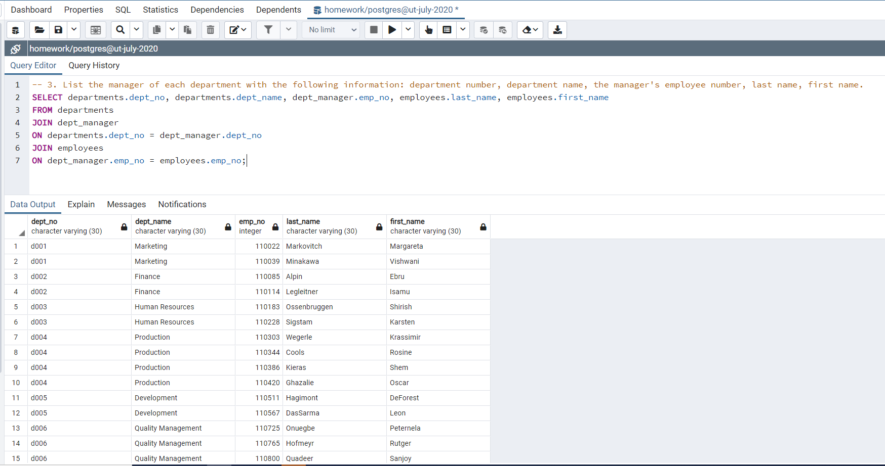
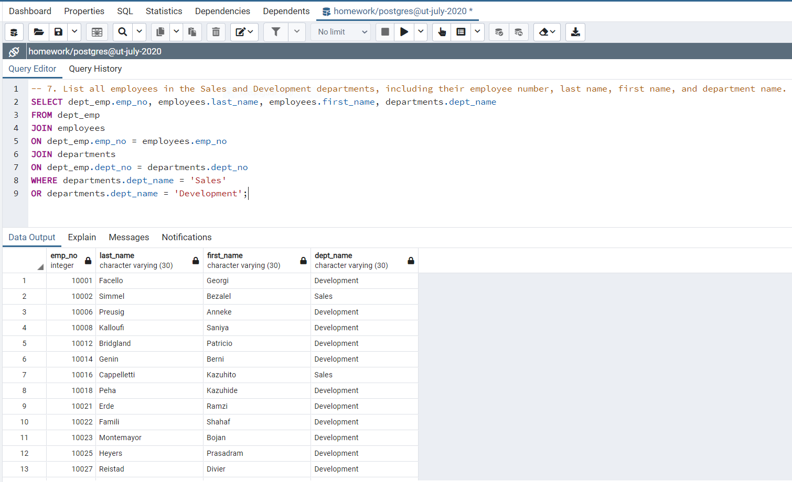

# **Employee Database: A Mystery in Two Parts**

## Background & Instructions

It is a beautiful spring day, and it is two weeks since you have been hired as a new data engineer at Pewlett Hackard. Your first major task is a research project on employees of the corporation from the 1980s and 1990s. All that remain of the database of employees from that period are six CSV files.

In this assignment, you will design the tables to hold data in the CSVs, import the CSVs into a SQL database, and answer questions about the data. In other words, you will perform:

1. Data Modeling
2. Data Engineering
3. Data Analysis

## Data Modeling
Inspecting the six CSV files and sketching out an ERD of the tables using [http://www.quickdatabasediagrams.com]


## Data Engineering
Given the information, creating a table schema for each of the six CSV files and specifying data types, primary keys, foreign keys, and other constraints. Next, confirming CSV data import into the corresponding SQL table. 

```
-- dropping tables with IF EXISTS
DROP TABLE IF EXISTS titles;
DROP TABLE IF EXISTS departments;
DROP TABLE IF EXISTS employees;
DROP TABLE IF EXISTS dept_emp;
DROP TABLE IF EXISTS dept_manager;
DROP TABLE IF EXISTS salaries;

-- Creating tables and specifying data types, primary keys & foreign keys
CREATE TABLE titles (
    title_id VARCHAR(30) NOT NULL,
    title VARCHAR(30) NOT NULL,
    PRIMARY KEY (title_id)
    );

CREATE TABLE departments (
    dept_no VARCHAR(30) NOT NULL,
    dept_name VARCHAR(30) NOT NULL,
    PRIMARY KEY (dept_no)
    );

CREATE TABLE employees (
    emp_no INT NOT NULL,
    emp_title_id VARCHAR(30) NOT NULL,
    birth_date DATE NOT NULL,
    first_name VARCHAR(30) NOT NULL,
    last_name VARCHAR(30) NOT NULL,
    sex VARCHAR(30) NOT NULL,
    hire_date DATE NOT NULL,   
    PRIMARY KEY (emp_no),
    FOREIGN KEY(emp_title_id) REFERENCES titles (title_id)
    );

CREATE TABLE dept_emp (
    emp_no INT NOT NULL,
    dept_no VARCHAR(30) NOT NULL,
    FOREIGN KEY(emp_no) REFERENCES employees (emp_no),
    FOREIGN KEY(dept_no) REFERENCES departments (dept_no)
    );

CREATE TABLE dept_manager (
    dept_no VARCHAR(30) NOT NULL,
    emp_no INT NOT NULL,
    FOREIGN KEY(dept_no) REFERENCES departments (dept_no),
    FOREIGN KEY(emp_no) REFERENCES employees (emp_no)
    );

CREATE TABLE salaries (
    emp_no INT NOT NULL,
    salary INT NOT NULL,
    FOREIGN KEY(emp_no) REFERENCES employees (emp_no)
    );

-- Confirming data import with SELECT * FROM 
SELECT * FROM titles;
SELECT * FROM departments;
SELECT * FROM employees;
SELECT * FROM dept_emp;
SELECT * FROM dept_manager;
SELECT * FROM salaries;
```

## Data Analysis
Given the generated SQL tables, conducting data analyses with the SQL queries. Also, presenting the corresponding screen shots of the query results. It is important to note that the screen shots do not contain the entire query results due to space limitation.  

1. List the following details of each employee: employee number, last name, first name, sex, and salary.

```
SELECT employees.emp_no, employees.last_name, employees.first_name, employees.sex, salaries.salary
FROM employees
JOIN salaries
ON employees.emp_no = salaries.emp_no;
```


2. List first name, last name, and hire date for employees who were hired in 1986.

```
SELECT first_name, last_name, hire_date 
FROM employees
WHERE hire_date BETWEEN '1986-01-01' AND '1986-12-31';
```


3. List the manager of each department with the following information: department number, department name, the manager's employee number, last name, first name.

```
SELECT departments.dept_no, departments.dept_name, dept_manager.emp_no, employees.last_name, employees.first_name
FROM departments
JOIN dept_manager
ON departments.dept_no = dept_manager.dept_no
JOIN employees
ON dept_manager.emp_no = employees.emp_no;
```



4. List the department of each employee with the following information: employee number, last name, first name, and department name.

```
SELECT dept_emp.emp_no, employees.last_name, employees.first_name, departments.dept_name
FROM dept_emp
JOIN employees
ON dept_emp.emp_no = employees.emp_no
JOIN departments
ON dept_emp.dept_no = departments.dept_no;
```


5. List first name, last name, and sex for employees whose first name is "Hercules" and last names begin with "B."

```
SELECT first_name, last_name, sex
FROM employees
WHERE first_name = 'Hercules'
AND last_name LIKE 'B%';
```


6. List all employees in the Sales department, including their employee number, last name, first name, and department name.

```
SELECT dept_emp.emp_no, employees.last_name, employees.first_name, departments.dept_name
FROM dept_emp
JOIN employees
ON dept_emp.emp_no = employees.emp_no
JOIN departments
ON dept_emp.dept_no = departments.dept_no
WHERE departments.dept_name = 'Sales';
```


7. List all employees in the Sales and Development departments, including their employee number, last name, first name, and department name.

```
SELECT dept_emp.emp_no, employees.last_name, employees.first_name, departments.dept_name
FROM dept_emp
JOIN employees
ON dept_emp.emp_no = employees.emp_no
JOIN departments
ON dept_emp.dept_no = departments.dept_no
WHERE departments.dept_name = 'Sales' 
OR departments.dept_name = 'Development';
```



8. In descending order, list the frequency count of employee last names, i.e., how many employees share each last name.

```
SELECT last_name, COUNT(last_name) AS frequency
FROM employees
GROUP BY last_name
ORDER BY frequency DESC;
```


## Bonus
1. Importing the SQL database into Pandas.

```
from sqlalchemy import create_engine
import pandas as pd

connection_str = create_engine('postgresql://localhost:5432/<your_db_name>')

df_salaries = pd.read_sql("SELECT * FROM salaries", con=engine)
df_titles = pd.read_sql("SELECT * FROM titles", con=engine)
df_employees = pd.read_sql("SELECT emp_no, emp_title_id FROM employees", con=engine)
```

2. Creating a histogram to visualize the most common salary ranges for employees.

As the histogram depicts, the most common salary range for the employees is between USD 40,000 and 50,000 (less than USD 50,000 to be exact). Salaries of more than 140,000 employees fall into this range. Then there is a sharp decline. The number (frequency) of employees continues to decrease as the dollar amount of salary range increases. 


3. Creating a bar chart of average salary by title.

As the bar chart depicts, the highest average salary is USD 58,550 (approximately) earned by the Senior Staff. The next highest average salary is USD 58,465 (approximately) earned by the Staff. The average salary for manager is USD 51,531 (approximately). The average salary for Technique Leader, Assistant Engineer, Engineer, and Senior Engineer is between USD 48,506 and 48,582 (approximately). 


## Epilogue
Presenting the SQL queries and corresponding screen shot of the result for employee with ID number 499942.

```
SELECT employees.emp_no, titles.title, departments.dept_name, employees.first_name, employees.last_name, employees.sex, salaries.salary
FROM employees
JOIN titles
ON employees.emp_title_id = titles.title_id
JOIN dept_emp
ON employees.emp_no = dept_emp.emp_no
JOIN departments
ON dept_emp.dept_no = departments.dept_no
JOIN salaries
ON employees.emp_no = salaries.emp_no 
WHERE employees.emp_no = 499942;
```


## Technologies for Assignment
* quickdatabasediagrams for ERD
* SQL schema for table creation 
* SQL import for csv files data
* SQL queries for data analysis
* from sqlalchemy import create_engine
* engine = create_engine('postgresql://localhost:5432/<your_db_name>')
* connection = engine.connect()
* pandas
* matplotlib

